# 界面基础操作

## 拉选框
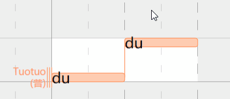

## Ctrl + 拉选框
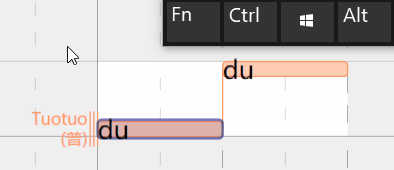

## 双击选择所有连音
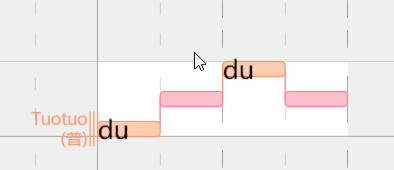

## 三击选择乐句
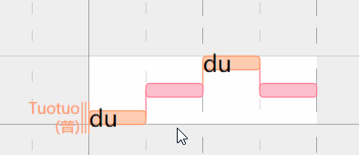

## 移动音符
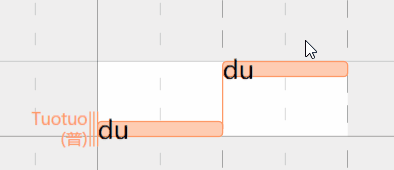

## 调整音符长度
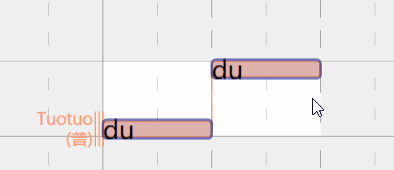

## 调整音符长度
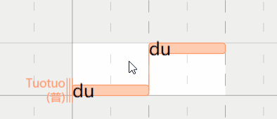

## Alt 写入音符
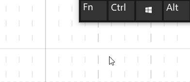

## Alt 也可以拆分音符连音
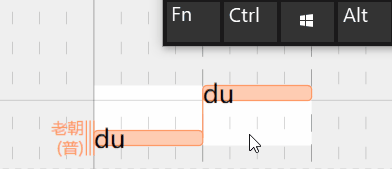

## 按 Enter 键输入歌词
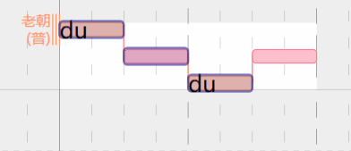

## 右键菜单也可以输入歌词
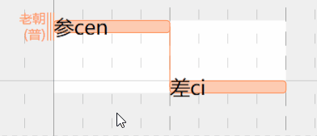

## 右键菜单替换多音字
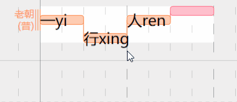

## 也可以手动修改发音
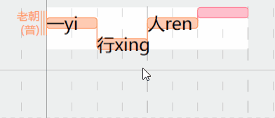

## 乐句选择 / 取消选择
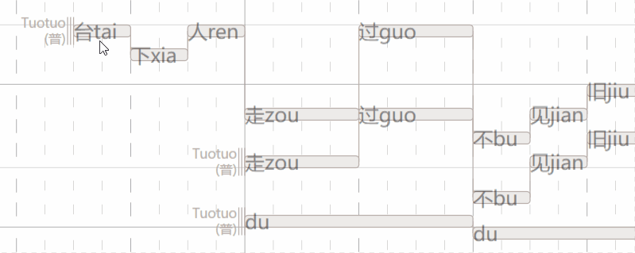

## 单击切换乐句
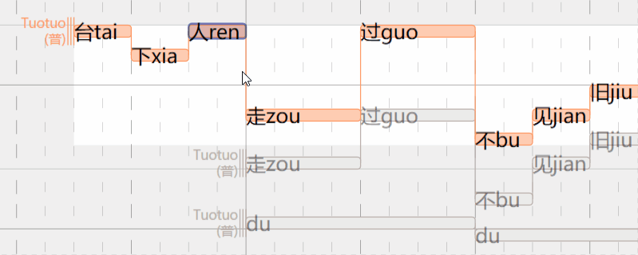

## 删除乐句：删除所有音符即可
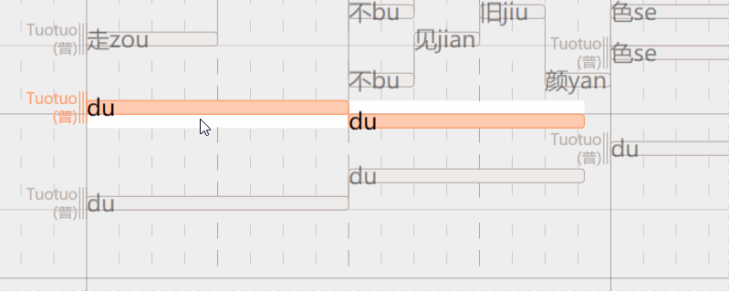

## 新建乐句：未选择乐句时写入音符
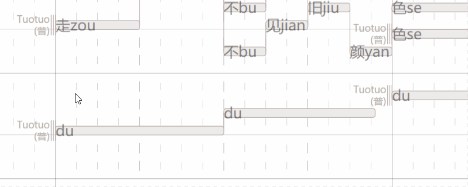

